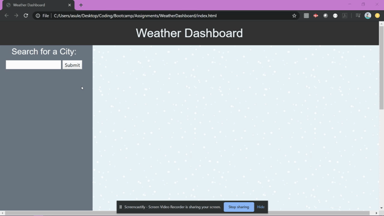

# [WeatherDashboard](https://asuleigh.github.io/WeatherDashboard/)
This project retrieves daily weather information for an inputted city using OpenWeather API

### Links
[WeatherDashboard](https://asuleigh.github.io/WeatherDashboard/)
 
[GitHub Repo](https://github.com/asuleigh/WeatherDashboard)

### GIF

ABSTRACT: This is a simple weather dashboard app that uses ajax calls to retrieve daily forecast information from the OpenWeather API. The user can search a particular city and the forecast will render in a new card.

Table of Contents:

i: Installation ii: Usage iii: Credits iv: License

i: INSTALLATION -In order to clone or download website for functionality on local drives, be sure to install files to proper locations.

-index.html should be located in the source folder. The source folder should also contain an "assets" folder.

-Inside of the "assets" folder, make sure there is an "images" folder, "css" folder, and "js" folder

-Clone or download images available to the "images" folder, css files to the "css" folder, and js files to the "js" folder

ii: USAGE -Layout is as it appears and is responsive. Input a city and click submit to see the daily forecast render to the right. You can render several city's forecasts at a time. The program uses ajax calls to retrieve information from the OpenWeather API.

iii: CREDITS -https://www.toptal.com/designers/subtlepatterns/ -https://w3schools.com -https://getbootstrap.com/ -

iv: LICENSE GNU GENERAL PUBLIC LICENSE Version 3, 29 June 2007

Copyright (C) 2007 Free Software Foundation, Inc. https://fsf.org/ Everyone is permitted to copy and distribute verbatim copies of this license document, but changing it is not allowed.

